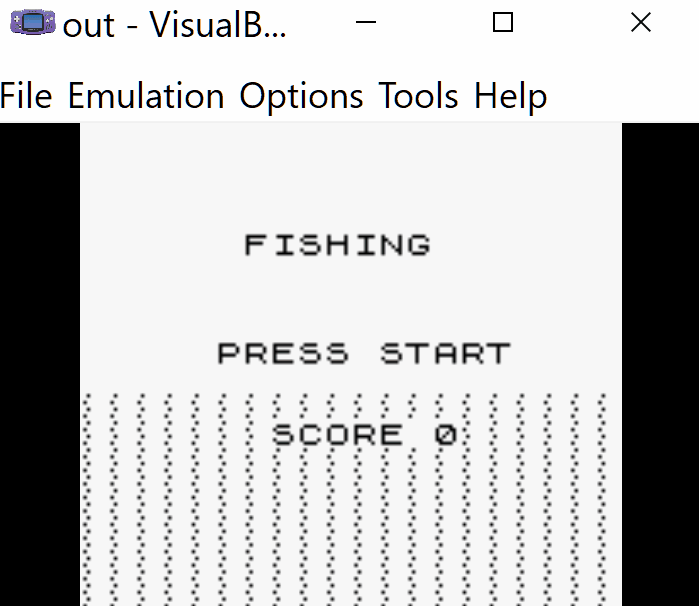

# GB Fishing Game

A simple, relaxing fishing game for the Game Boy, created in collaboration with Claude AI during a 10-hour game jam session.

GB Fishing Game is a peaceful fishing simulator where you can:

Cast your line with variable power
Attract and catch different types of fish
Watch clouds in the sky
Track your high score

Playing the Game
Download the ROM file and load it in your favorite Game Boy emulator.
Controls:

LEFT/RIGHT: Move along the pier
A: Hold to charge casting power, release to cast
B: Hold to reel in
START: Pause/unpause

Building from Source

Install GBDK-2020 (https://github.com/gbdk-2020/gbdk-2020)
Clone this repository
Run {path-to-gbdk}/bin/lcc -o fishing.gb main.c

Credits
Created through pair programming with Claude AI (Anthropic).
Binary
Pre-built ROM is available in the releases section.
License
Feel free to use this code for learning or your own projects!